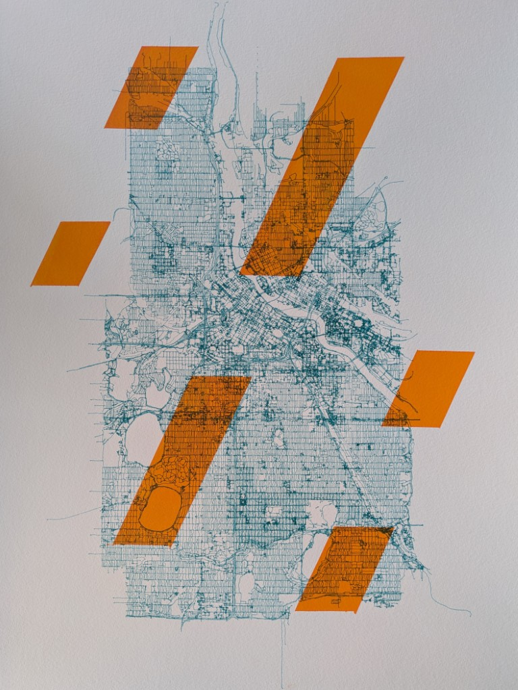

---

permalink: /custom/

title: "Custom Work"

---
I have a number of different custom work offerings, so take a look and reach out via Instagram or email and I'll walk you through the process! If you don't see what you want, still reach out and we'll talk through your request.

## One of your pieces that already sold...
"Can you make something similar to what you made before?" 

Sure, just send me the image!

## Maps
"I see you do maps..."

Using a tool called [city roads](https://anvaka.github.io/city-roads) that renders geogrpahy in SVG format, I can easily turn your favorite city into a work of art!

## Photos
"Can you create a plot of a photo I have?" 

Yes! I use a tool called [DrawingBotV3](https://drawingbotv3.com/) that interprets photos as line drawings, with a number of different design and color options.

## I have a design...
"I have a digital design that I want plotted!" 

I can do that too, if it's just an image, I will use a similar process to the Photos option above, but if it's already an SVG design, we can work on making it plotter-ready!

## Details
I'll need some info from you, depending on how hands-on you want to be in the process!
- On what size paper?
- Color prefernces?
- Do you want any painted bits?
- Do you want to vet the digital design before I plot it?
- Do you want to be involved in the finer points of the design? 
    - We can do an in person, or video, session and work through it together.