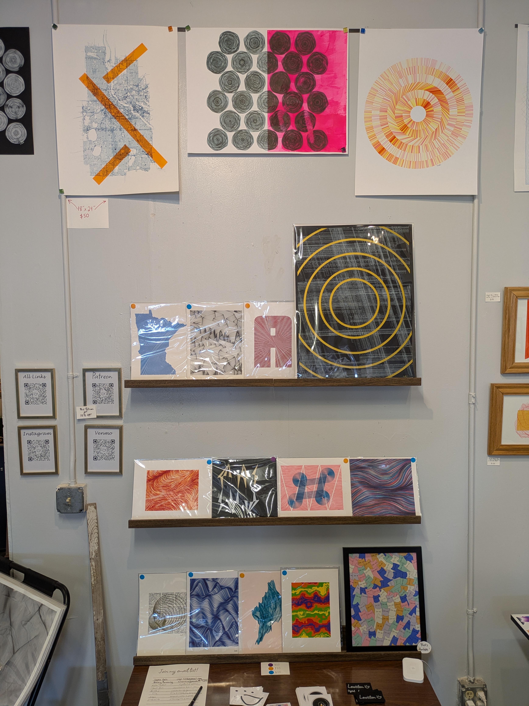

---

permalink: /studio/

title: "My Studio Space!"

---

Come see my stuff in person! I'm currently located in Studio #406 in the [Northrup King Building](https://www.northrupkingbuilding.com) in Northeast Minneapolis! I share the space with 6 other artists, and I always have something plotting during open studio times so everyone can see the robot drawing in action!

The studio is where I keep my **big** plotters, capable of doing designs on 18x24 inch paper.

## Open Studio
I *try* to be in the studio **every Saturday 12-4pm** for building-wide open studio time, but sometimes life gets in the way. If you're coming specifically to see my work, please reach out ahead of time to make sure that I'll be around.

There are also many events year round, like Art-A-Whirl and Art Attack, that I particpate in, so keep an eye out for those and join my newsletter to keep up to date on what I'm doing in-person. 

I'm also open to scheduling a time for you to come in, so again, just reach out!
